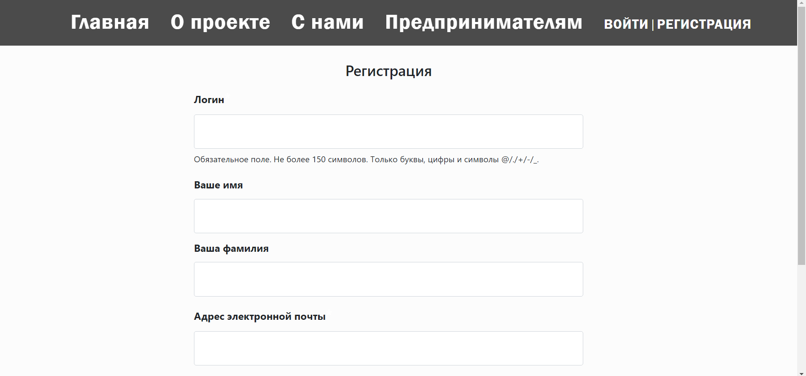
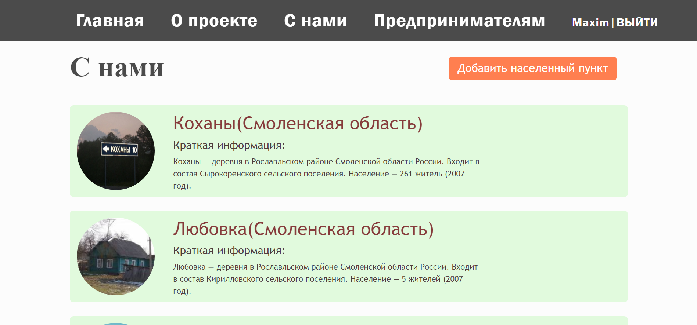
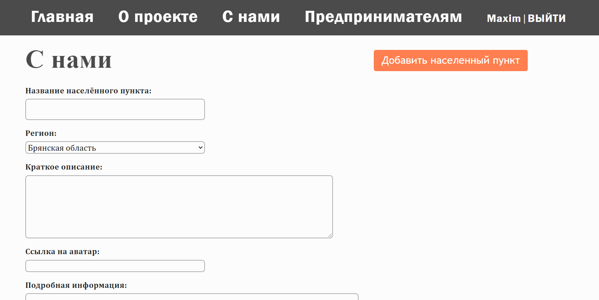
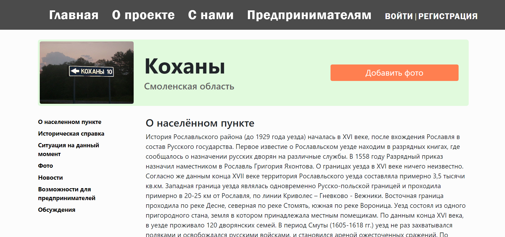
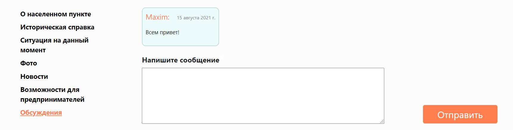
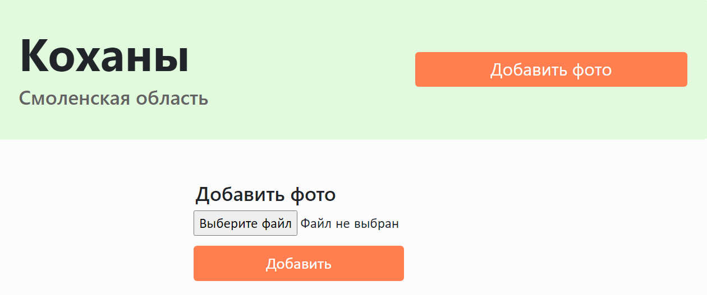
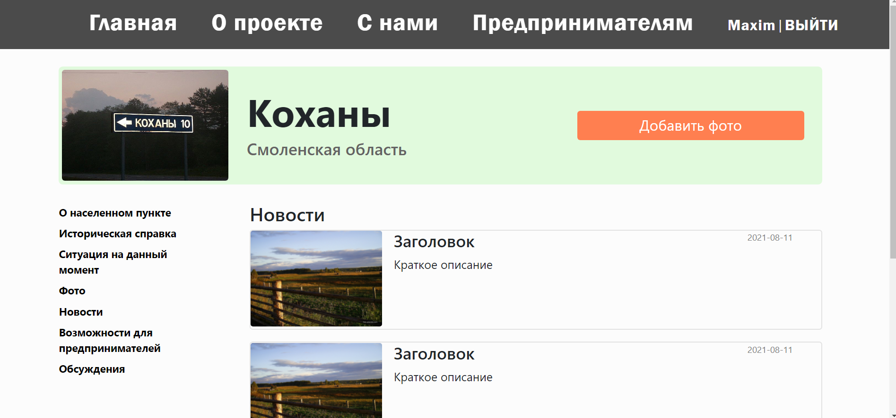

# Документация


## Установка и запуск на локальном сервере:
1. Клонировать или сохранить репозиторий
1. Создать и активировать виртуальное окружение
   ```
    python3.9 -m venv env 
    . ./env/bin/activate
   ```
2. Установить необходимые пакеты 

   ```
   pip install -r requirements.txt
   ```
3. Запуск локального сервера
   ```
   cd ./village/
   python3.9 manage.py runserver

   *При получении ошибок миграций выполнить:
   python3.9 manage.py makemigrations
   python3.9 manage.py migrate     
   ```
***
## Руководство:

_В руководстве вы можете найти соответствие функционала проекта к файлам, в которых написана логика, отвечающая за этот функционал. Все пути будут указаны относительно директории village, которая лежит в корневой директории проекта. В руководстве не будет пояснений по коду, они находятся в файлах, к которым указан путь, в качестве docString и комментариев._

#### Страницы "О проекте" и "Предпринимателям"


##### HTML:
>crm/templates/crm/layout.html
_В этой же директории можно найти шаблон для домашней страницы (index.html)_

##### CSS:
>static/crm/css/styles_layout.css
_В этой жу директории можно найти стили для домашней страницы (styles.css)_

##### Роутинг:
>crm/urls.py

##### Контролер:
>crm/views.py

##### Бизнес-логика:
>crm/models.py
crm/services.py
***

## Регистрация и авторизация

Регистрация и авторизация пользователей реализована с помощью встроенной в Django системы пользователей.



##### HTML:
Шаблон для отображения формы регистрации:
>users_system/templates/users_system/registration.html

Шаблон для отображения формы авторизации:
>users_system/templates/users_system/authorisation.html

##### CSS:
>static/users_system/css/forms_styles.css

##### Формы:
>users_system/forms.py

##### Роутинг:
>users_sysrem/urls.py

##### Контролер:
>users_system/views.py

##### Бизнес-логика:
>users_system/services.py
***


## Вкладка "С нами"


##### HTML:
>crm/templates/crm/with_us.html

##### CSS:
>static/crm/css/styles_for_with.css

##### Роутинг:
>crm/urls.py

##### Контролер:
>crm/views.py

##### Бизнес-логика:
>crm/models.py  
Модель для отображения данных: village_data
****

## Форма для добавления населённого пункта


##### HTML, CSS, Роутинг, Контролер:
>Такие же как и для вкладки "С нами"

##### Формы:
>crm/forms.py

##### Бизнес-логика:
>crm/models.py
crm/services.py
***
## За отображения подробной информации о каждом из населённых пунктов отвечают:


##### HTML:
>main_village/templates/main_village/villages.html

##### CSS:
>static/main_village/css/village_app_styles.css

##### Роутинг:
>main_village/urls.py

##### Контролер:
>main_village/views.py

##### Бизнес-логика:
>crm/models.py
main_village/services.py  


#### Вкладки  сайдбара:
* О населенном пункте
* Историческая справка
* Ситуация на данный момент
* Фото
* Возможности для предпринимателей
  
#### для каждой деревни отображаются с помощью бизнес-логики, прописанной в файле:
>static/main_village/js/main_village.js

## Чат населенного пункта



##### HTML, CSS, Роутинг, Контролер, Бизнес-логика:
>Такие же как и для вкладки, в которой содержится подробная информация о наеленном пункте

##### Форма:
>main_village/forms.py
***

## Форма для добавления фотографий населенного пункта


##### HTML, CSS, Роутинг, Контролер, Бизнес-логика, Форма:
>Такие же как и в пункте выше

***
## Вкладка новости населенного пункта


##### HTML, CSS, Роутинг, Контролер, Бизнес-логика:
>Такие же как и в пункте выше
